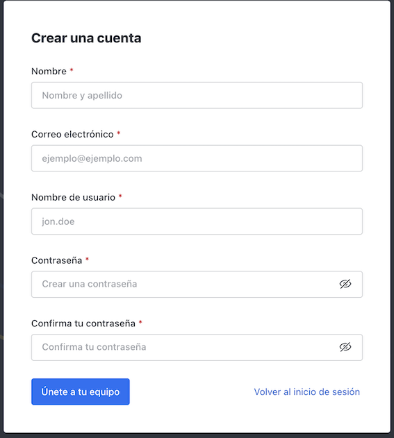

Rocket.chat
====================

El rocket.chat de Red-Lanirem está en la siguiente dirección `AQUÍ <https://chat-lanirem.lavis.unam.mx>`_

**Ya tienes cuenta y no puedes entrar desde la app de tu télefono?** : `Sigue este link. <https://hackmd.io/EUm9hfDcRYecYU_Uov5lNA?view>`_

Crear nueva cuenta
--------------------

Si es la primera vez que nos visitas, crea una nueva cuenta (`Register a new account <https://chat-lanirem.lavis.unam.mx/home>`_):

Lo más recomendable es instalar las aplicaciones oficiales de rocket.chat, disponibles para Windows, Mac, y 
Linux, así como para teléfonos iOS y Android, disponibles en el siguiente link `AQUÍ 
<https://rocket.chat/install/>`_.

Si no quieres instalar las aplicaciones, puedes usar rocket.chat directamente en tu navegador web con la URL arriba mencionada.

Conceptos básicos
--------------------

La comunicación en rocket.chat se da en *canales*. Los canales pueden ser privados o públicos; en el caso de los privados, deberás ser invitado por la persona que administra el canal. Todos los usuarios están inscritos en los canales #general y #journalclub. El resto de los canales pueden variar entre usuarios. Aquí un ejemplo:

.

Destacados
--------------------

Si tienes un especial interés en palabras clave, puedes ponerlas aquí. Si esas palabras son usadas en cualquier canal en el que estés, recibirás una notificación. Ejemplos de palabras clave son *cancelado, descompuesto, publicado, fiesta*, etc.

Disfruta de chat-lanirem con rocket.chat!
